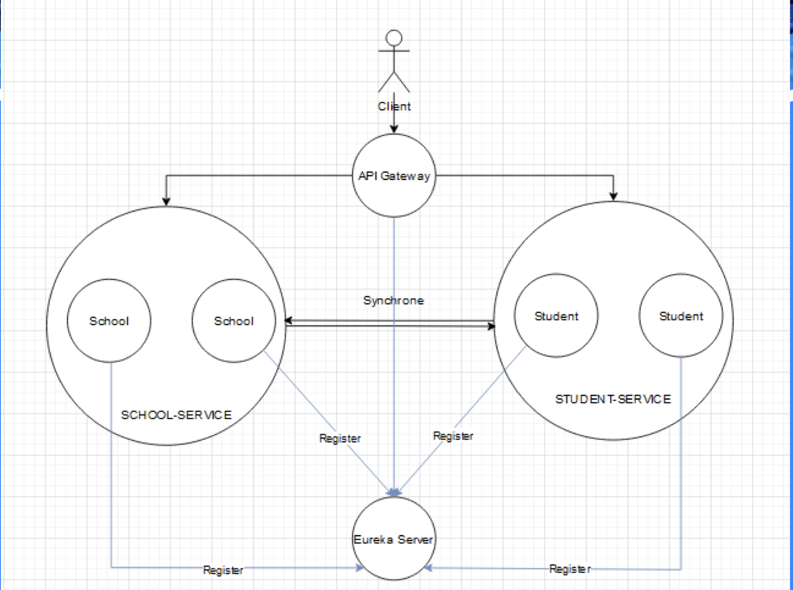

# MICRO-SERVICES JAVA - Renforcement backend

!! Ce projet est un exemple de microservices en Java avec Spring Boot. !!

Toutes les informations sont fictives.

Les tables ne sont pas secures, les mots de passe ne sont pas cryptés, etc...

## Schema de configuration



# <span style="color:rgb(178, 38, 38)">Micro-services</span>

### 1. Student Service

Le **Student Service** gère les informations des étudiants (ajout, suppression, récupération). Ce service est conçu pour tester les microservices avec des entités simples, sans relations complexes.

Il communique avec le **School Service** pour récupérer des informations sur les établissements scolaires des étudiants.

---

### 2. School Service

Le **School Service** gère les informations des établissements scolaires (ajout, modification, suppression, récupération).

Comme le **Student Service**, il est conçu pour des entités simples, sans relations complexes.

---

### 3. Authentification Service

L'**Authentification Service** gère l'authentification et l'autorisation des utilisateurs en fournissant des tokens JWT pour sécuriser les requêtes.

---

### 4. Eureka Server

**Eureka** est un serveur permettant aux microservices de s'enregistrer et de découvrir d'autres services. Il facilite la communication entre les services sans avoir à connaître leurs adresses IP.

---

### 5. API Gateway

L'**API Gateway** est le point d'entrée pour les requêtes client. Elle redirige les requêtes vers les microservices appropriés et gère des fonctionnalités comme l'authentification, le logging, etc...

# <span style="color:rgb(178, 38, 38)">Mise en place de l'application</span>

### 1. Cloner le repository GitHub

Clonez le projet en utilisant la commande suivante :

```sh
git clone https://github.com/DjibrilNaji/microservices-java.git
```

### <span style="color:rgb(38, 178, 99)">2. Docker</span>

Lancer docker si ce n'est pas déjà fait.

De plus, les bases de données doivent être créées manuellement pour les services utilisant PostgreSQL (Authentification Service, School Service).

### <span style="color:rgb(38, 178, 99)">3. Lancer les services</span>

Installer maven si ce n'est pas déjà fait.

Pour lancer les services, il suffit de lancer les commandes suivantes :

```sh
cd eureka && mvn install && mvn spring-boot:run
```

```sh
cd school && mvn install && mvn spring-boot:run
```

```sh
cd student && mvn install && mvn spring-boot:run
```

```sh
cd gateway && mvn install && mvn spring-boot:run
```

```sh
cd authentification && mvn install && mvn spring-boot:run
```

### <span style="color:rgb(38, 178, 99)">3. Tester les services</span>

Pour tester les services, vous pouvez utiliser Postman ou tout autre outil de test d'API.

```py
http://localhost:8083/
```

### **_L'URL à utiliser pour accéder à l'API Gateway est la suivante :_**

# <span style="color:rgb(178, 38, 38)">Authentification Service</span>

## Routes

- ### Register User (**POST** "/auth/register")

This route allows you to create a new user.

#### Here is a `body` type

```json
{
  "username": "user",
  "password": "password"
}
```

- ### Login User (**POST** "/auth/login")

This route allows you to login a user.

#### Here is a `body` type

```json
{
  "username": "user",
  "password": "password"
}
```

# <span style="color:rgb(178, 38, 38)">School Service</span>

## Routes

- ### Get all schools (**GET** "/schools")

This route allows you to get all schools.

Here is a `response` type

```json
[
  {
    "id": 1,
    "name": "school",
    "address": "address",
    "directorName": "directorName"
  }
]
```

- ### Get school by id (**GET** "/schools/{id}")

This route allows you to get a school by id.

Here is a `response` type

```json
{
  "id": 1,
  "name": "school",
  "address": "address",
  "directorName": "directorName"
}
```

- ### Create school (**POST** "/schools")

This route allows you to create a school.

#### Here is a `body` type

```json
{
  "name": "school",
  "address": "address",
  "directorName": "directorName"
}
```

- ### Delete school (**DELETE** "/schools/{id}")

This route allows you to delete a school.

# <span style="color:rgb(178, 38, 38)">Student Service</span>

## Routes

- ### Get all students (**GET** "/students")

This route allows you to get all students.

Here is a `response` type

```json
[
  {
    "id": 1,
    "name": "firstName",
    "genre": "genre",
    "schoolId": 1
  }
]
```

- ### Get student by id (**GET** "/students/{id}")

This route allows you to get a student by id.

Here is a `response` type

```json
{
  "id": 1,
  "name": "firstName",
  "genre": "genre",
  "schoolId": 1,
  "school": {
    "id": 1,
    "name": "school",
    "address": "address",
    "directorName": "directorName"
  }
}
```

- ### Create student (**POST** "/students")

This route allows you to create a student.

#### Here is a `body` type

```json
{
  "name": "firstName",
  "genre": "genre",
  "schoolId": 1
}
```

- ### Delete student (**DELETE** "/students/{id}")

This route allows you to delete a student.

# Sécurisation des Microservices

### Authentification et Autorisation

Le **Authentification Service** permet de sécuriser l'ensemble des microservices en imposant l'utilisation de tokens JWT. Lorsqu'un utilisateur s'authentifie via le service d'authentification, il reçoit un token JWT valide qui devra être inclus dans les en-têtes des requêtes pour accéder aux autres microservices.

Voici un exemple de configuration de l'authentification dans les autres microservices :

- Tous les microservices, à l'exception du **Gateway** et **Authentification Service**, doivent valider le token JWT reçu dans les requêtes.
- Si le token est valide, la requête est traitée.
- Si le token est invalide ou absent, la requête est rejetée avec un message d'erreur d'authentification.

# <span style="color:rgb(22, 152, 208)">Récapitulatif des Routes de l'API Gateway</span>

L'API Gateway expose des routes génériques pour rediriger les requêtes vers les microservices appropriés. Voici un exemple de routage :

- POST `/auth/login` → Dirige vers le **Authentification Service**
- POST `/auth/register` → Dirige vers le **Authentification Service**
- GET `/students` → Dirige vers le **Student Service**
- POST `/students` → Dirige vers le **Student Service**
- GET `/schools` → Dirige vers le **School Service**
- POST `/schools` → Dirige vers le **School Service**

L'API Gateway permet également de centraliser la gestion de la sécurité, du logging, et d'autres fonctionnalités transverses, comme la gestion des erreurs.

# <span style="color:rgb(22, 152, 208)">Exemple d'Interaction entre les Services</span>

Prenons un exemple complet où un utilisateur se connecte, puis récupère la liste des étudiants d'une école.

### 1. L'utilisateur se connecte :

- Envoi de la requête POST `/auth/login` avec le nom d'utilisateur et le mot de passe.
- L'**Authentification** Service valide les informations, génère un token JWT, et le retourne.

### 2. L'utilisateur utilise le token pour accéder aux données des étudiants :

- Envoi de la requête GET `/students` à **l'API Gateway**, avec le token JWT dans l'en-tête Authorization.
- L'API Gateway valide le token et redirige la requête vers le Student Service.
